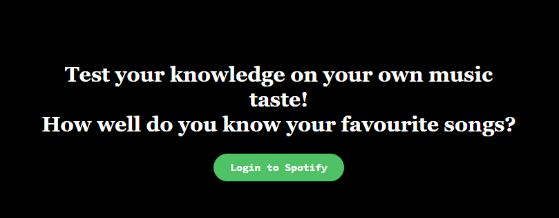
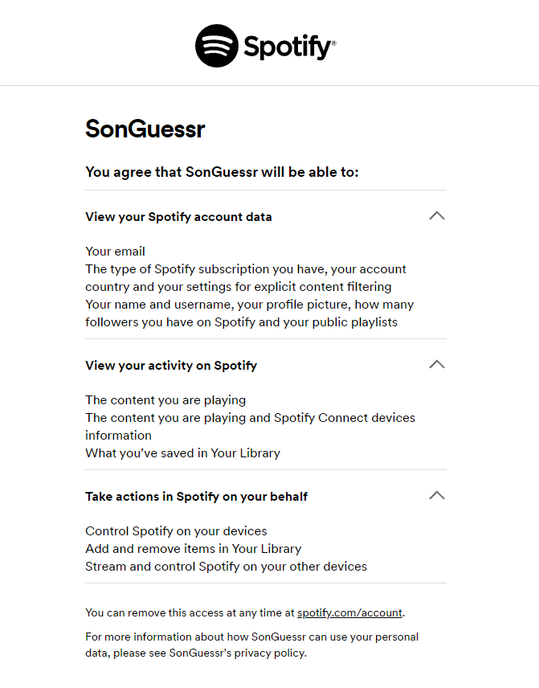
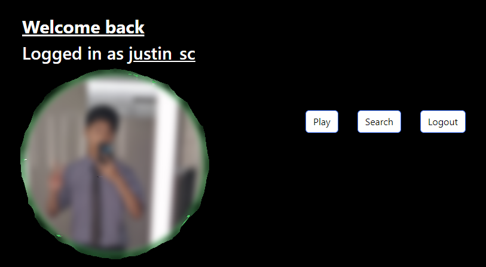
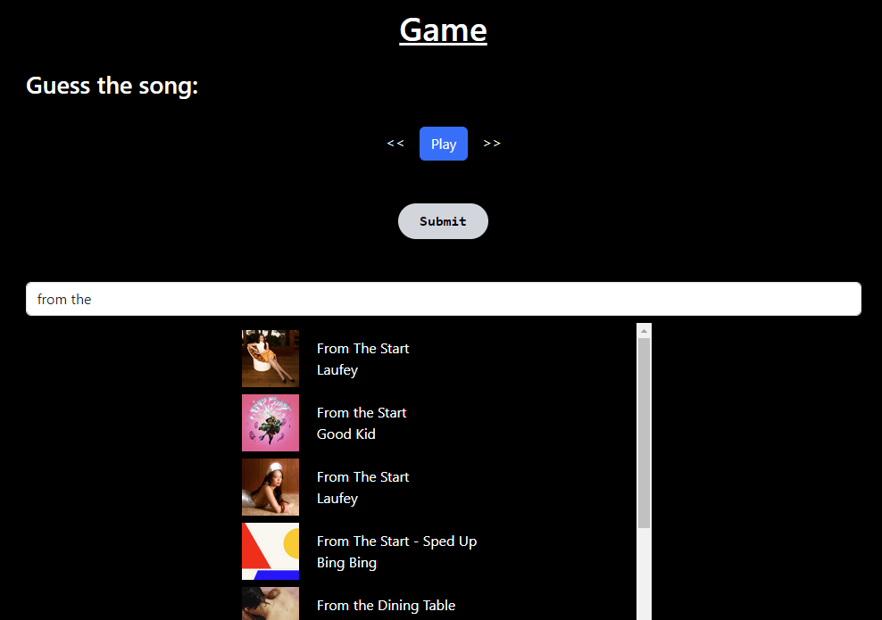
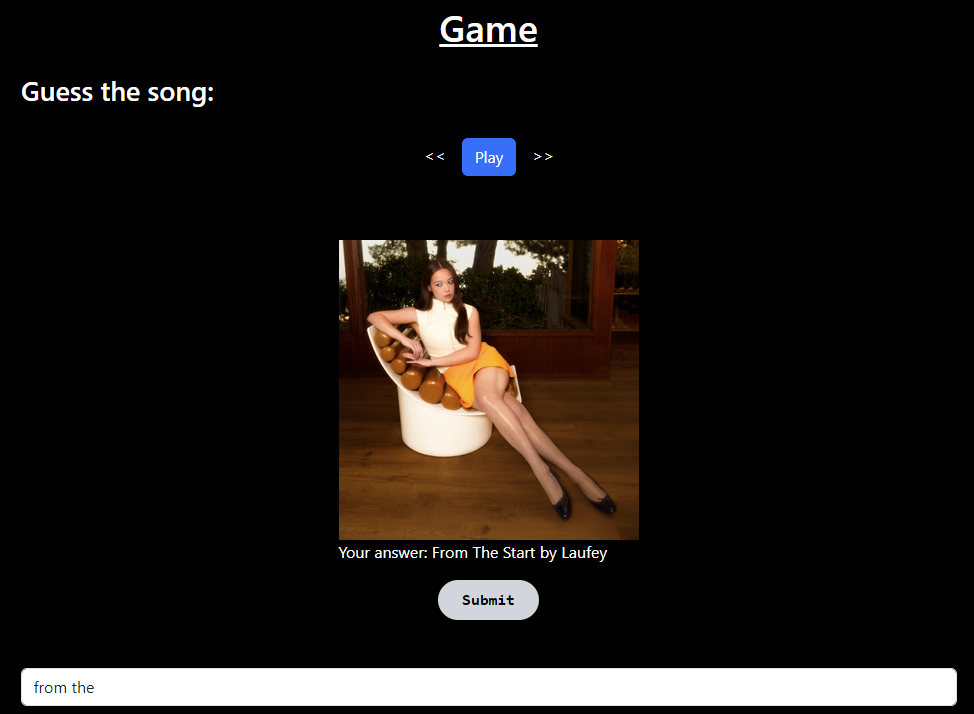

# SpotiGuessr 🎵🤔

A ReactJS + Tailwind web app that tests the player on their personal Spotify playlist knowledge via short audio snippets in a time-based game.

## Technologies Used
> ReactJS, TailwindCSS, Spotify Web API, Spotify Web Playback SDK

## Getting Started

Clone the repository to your local machine with `git clone`

To install all dependencies within the root folder, paste this in your terminal
### `npm install`

Run the project on localhost:3000
### `npm start`

## Navigating through the App

    Upon login, you must authenticate your Spotify account as it is required for SpotiGuessr to be able to access your playlist data and user information. Keep in mind a premium account is required to allow playback of audio through the API!

    Through the homepage you have the options to play a round, search through your playlists, or logout of the application.

    

    In the game, you may need to first transfer the playback from your personal device to SpotiGuessr so it can play audio. Pressing play will play a short audio clip of a song from your personal playlist, from where you will need to guess the song within the search bar. You have multiple attempts!

## Video Demo of the Game v1.0
Here is the url for the video demonstration (including audio) of the game:
[SpotifyGuessr Game Demo](https://youtu.be/37P4sBEBP3o)

## To Do
- clean up refresh token logic
- add more animations for page and button transition
- scale game to multiple levels/songs

`v1.0`

